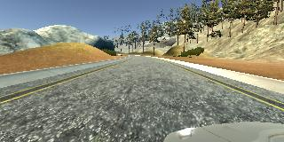
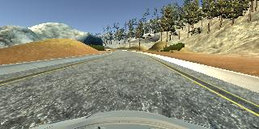
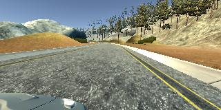
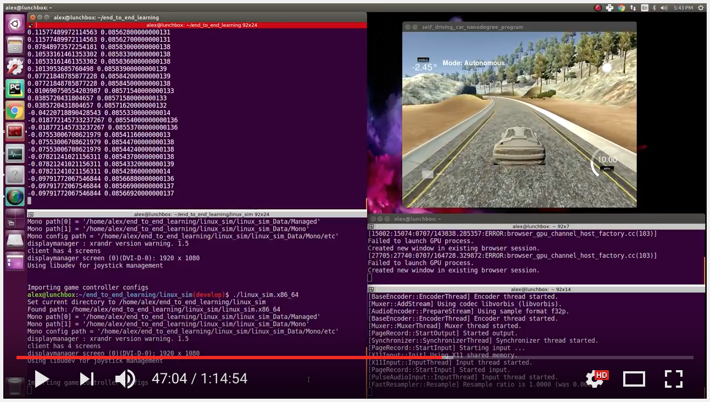
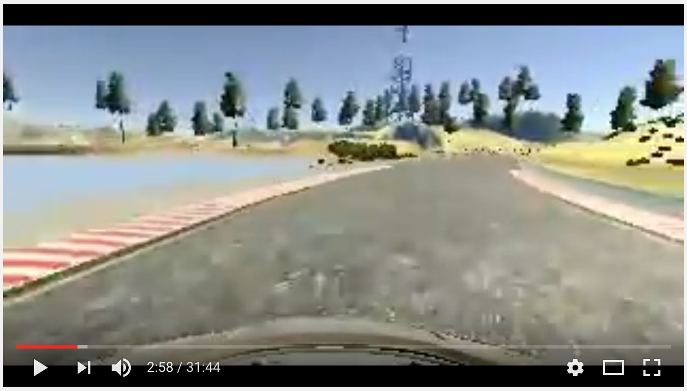
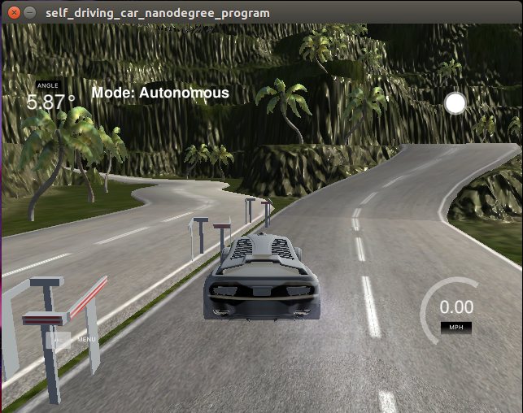

## End-to-End Learning in a Driving Simulation

### Abstract

This project implements the 2016 paper [End to End Learning for Self-Driving Cars](https://arxiv.org/pdf/1604.07316.pdf) in which 
Bojarski et al. describe a convolutional neural network architecture used to infer vehicle control inputs given a forward 
facing vehicle camera stream. I apply the techniques in this paper to a [driving simulation game](https://github.com/udacity/self-driving-car-sim) 
: a player inputs controls to the simulator's virtual vehicle, and the mapping between the 
scene in front of the car and the player's controls is modeled by a neural network to "autonomously drive" the virtual car. 
Once trained, this neural network implementation drives a virtual car for dozens of laps around a virtual track with no 
human intervention.

### Installation

This procedure was tested on Ubuntu 16.04 (Xenial Xerus) and Mac OS X 10.11.6 (El Capitan). GPU-accelerated training is supported on Ubuntu only.
Prerequisites: Install Python package dependencies using [my instructions.](https://github.com/alexhagiopol/deep_learning_packages) Then, activate the environment:

    source activate deep-learning
    
Acquiring the driving simulator and example dataset with camera stream images and steering control inputs by a human player:

    wget https://d17h27t6h515a5.cloudfront.net/topher/2017/February/58ae46bb_linux-sim/linux-sim.zip  # linux version of simulator
    unzip linux-sim.zip
    rm -rf linux-sim.zip
    wget -O udacity_dataset.tar.gz "https://www.dropbox.com/s/s4q0y0zq8xrxopi/udacity_dataset.tar.gz?dl=1"  # example dataset
    tar -xvzf udacity_dataset.tar.gz
    rm -rf udacity_dataset.tar.gz

Optional, but recommended on Ubuntu: Install support for NVIDIA GPU acceleration with CUDA v8.0 and cuDNN v5.1:

    wget -O cuda-repo-ubuntu1604-8-0-local-ga2_8.0.61-1_amd64.deb "https://www.dropbox.com/s/08ufs95pw94gu37/cuda-repo-ubuntu1604-8-0-local-ga2_8.0.61-1_amd64.deb?dl=1"
    sudo dpkg -i cuda-repo-ubuntu1604-8-0-local-ga2_8.0.61-1_amd64.deb
    sudo apt-get update
    sudo apt-get install cuda
    wget -O cudnn-8.0-linux-x64-v5.1.tgz "https://www.dropbox.com/s/9uah11bwtsx5fwl/cudnn-8.0-linux-x64-v5.1.tgz?dl=1"
    tar -xvzf cudnn-8.0-linux-x64-v5.1.tgz
    cd cuda/lib64
    export LD_LIBRARY_PATH=`pwd`:$LD_LIBRARY_PATH  # consider adding this to your ~/.bashrc
    cd ..
    export CUDA_HOME=`pwd`  # consider adding this to your ~/.bashrc
    sudo apt-get install libcupti-dev
    pip install --ignore-installed --upgrade https://storage.googleapis.com/tensorflow/linux/gpu/tensorflow_gpu-1.1.0-cp35-cp35m-linux_x86_64.whl

### Execution
#### Model Training with `model.py`

This file is the core of this project. Use it to train the NVIDIA model on a driving dataset. Use `python model.py -h`
to see documentation information. Example command:
    
    python model.py -d udacity_dataset -m model.h5 -c 3000

The program assumes the following: 
1. The required `-d` argument is a path to the dataset directory.
    - The dataset directory contains a single .csv file with a driving log along with many .jpg images recorded from the player driving sequence associated with the log.
    - The image names in the driving log match the images names in the dataset directory. I.e. image names such as `dir/IMG/center_2016_12_01_13_30_48_287.jpg`
should be replaced in the driving log with simply `center_2016_12_01_13_30_48_287.jpg`. Use scripts such as `scripts/combine_datasets.py` and `scripts/fix_filenames.py`
to prepare your dataset to work with this pipeline. 
    - It's recommened that you start with the example dataset provided in the installation instructions.
2. The required `-m` argument is the name of the Keras model to export.
3. The optional `-c` argument is the CPU batch size i.e. the number of measurement groups that will fit in system RAM on your machine. The default value of 1000 should fit comfortably in a 16GB RAM machine.
4. The optional `-g` argument is the GPU batch size i.e. the number of training images and training labels that will fit in VRAM on your machine. The default value of 512 should fit comfortable in a 6GB VRAM machine.
5. The optional `-r` argument specifies whether or not to randomize the row order of the driving log.

#### Acquiring a Pre-Trained Model

In case you do not want or are not able to train a neural network on your machine, you can download [my pre-trained model](https://www.dropbox.com/s/l9f4gqb596rnjst/model.h5?dl=0)
which successfully drives autonomously around a virtual track:

    wget -O model.h5 "https://www.dropbox.com/s/l9f4gqb596rnjst/model.h5?dl=1"

#### Driving Autonomously with a trained model, `drive.py`, and the Unity Simulator

Use `drive.py` in conjunction with the simulator to autonomously drive a virtual car according to a neural network model.
 Usage of `drive.py` requires you to have saved the trained model as an h5 file, e.g. `model.h5`. This type of file is created 
by running `model.py` as described above. Once the model has been saved, it can be used with drive.py using this commands:

    python drive.py model.h5

This command prepares causes the driving program to start and wait for the simulator to be initialized. On Linux, initialize the 
simulator with the following (procedure is very similar on Mac):

    cd linux_sim
    ./linux_sim.x86_64

Select the lowest resolution and fastest graphical settings. Afterward select "autonomous mode" followed by the desired track. The car 
will now drive on its own. This procedure loads the trained model and uses the model to make predictions on individual images in real-time 
and send the predicted angle back to the simulator server via a websocket connection.

#### Saving a Video of Vehicle Performance with `drive.py` and `video.py`.

    python drive.py model.h5 run1

The fourth argument, `run1`, is the directory in which to save the images seen by the agent. If the directory already exists, it'll be overwritten. The 
image file name is a timestamp of when the image was seen. This information is used by `video.py` to create a chronological video of the agent driving.
The following command...

    python video.py run1

...creates a video based on images found in the `run1` directory. The name of the video will be the name of the directory 
followed by `'.mp4'`, so, in this case the video will be `run1.mp4`. Optionally, one can specify the FPS (frames per second) of the video
like so:

    python video.py run1 --fps 48

This will run the video at 48 FPS. The default FPS is 60.

### Technical Report
#### Dataset Creation

A human player plays the simulation game manually and records game footage that is later used to train a neural network.
On one of each six animation frames of the simulator (10 Hz), three virtual cameras on the front of the car capture 3 images into the dataset: 
a center image, a left side image, and a right side image. Over the course of gameplay, tens of thousands of (image, steering input)
data pairs are recorded.

Left Camera View | Center Camera View | Right Camera View
----|--------|-------
 |  | 

#### Preprocessing
At each moment in which player data is recorded, a single steering input is recorded. This steering input is thus associated with 
three images: a left image, a center image, and a right image. However at inference time, a single steering input is inferred by
the neural network given a single center view image. Thus, to make the left and right view images useful for neural network training,
the steering input is increased by 0.2 degrees for a left image and decreased by 0.2 degrees for a right image.

Furthermore, the network must learn how to react to all kinds of turns. Unfortunately, a racing track will provide mostly left
turns as examples because the car travels along the track counterclockwise. Thus the dataset is augmented with horizontally flipped
versions of the three types of input images described in the previous paragraph as shown below:

In total, for each moment in which player training data is collected, 6 (image, steering input) pairs are added as training examples for
the neural network. The next preprocessing step is cropping to remove parts of the scene that do not contain the road and
 normalization to ensure numerical stability during weight value optimization. The final preprocessing step is randomization: 
 the dataset is shuffled such that the order of the (image, steering input) pairs is random.

#### Neural Network Architecture
This project uses a Keras implementation of the model described by Bojarski et al in the paper [End to End Learning for Self-Driving Cars](https://arxiv.org/pdf/1604.07316.pdf)
which uses the convolutional architecture depicted in the following figure from the paper:

Rectified linear units are used as activation functions for each layer. Unlike the paper, this project performs 
preprocessing (including normalization) in batches outside of the training procedure. Thus, preprocessing is not GPU accelerated, 
but also does not have to be re-performed each time the network is retrained. For real-time performance applications, the GPU 
implementation of any preprocessing steps should be considered to increase the inference framerate.

#### Training
The example dataset contains over 24,000 example camera views. With preprocessing, this total rises to over 48,000 training examples.
This project implements user-configurable batch-based training such that the dataset is trained in batches big enough to fit in CPU
and GPU memory. The neural network is trained using Keras implementation of the Adam optimizer and the mean squared error
loss function. Before training and batching begins, the dataset is divided into training and validation sets: 20% of the
dataset is reserved for validation. Using an NVIDIA GTX 1060 GPU and Intel Pentium G4600 CPU, training the entire dataset 
in batches for 15 epochs per batch takes 10 minutes.

#### Results
This neural network implementation successfully drives a virtual car for dozens of laps around a virtual track with no 
human intervention. Over 1 hour of video evidence is provided below:

Autonomous Mode Full Screen Capture | Autonomous Mode FPV Feed
---------|----------
 | 

As is to be expected, obstacles and terrain not encountered in the training set cause issues if they appear in the test
set. When the neural network's performance was tested on a track with a differently patterned driving surface, different 
surrounding flora, and different obstacles, the network's decisions caused collisions and poor dirving performance. The folowing
figure illustrates a collision with an obstacle type not encountered in the training set that appears in a different testing track:

#### Conclusions and Future Work
Although the driving performance observed in the videos is encouraging, much work remains to create a complete autonomous agent 
for simulated driving. Future work on this project will be aimed at improving the generalization capabilities of this technique such that the 
system will be able to competently drive in diverse simulated environments. Two ways to improve generalization are 
to (1) augment the training dataset with more varied data and (2) to increase the sophistication of the algorithm applied to
this problem. Method (1) can be implemented by carrying out more human-controlled simulated driving runs to record more
training data. This method is limited in that it scales poorly because it requires long hours of manual work. Method (2)
can be implemented by either (a) researching improved network architectures for end-to-end learning and (b) attempting 
improved preprocessing techniques not discussed in the cited paper. Option (b) could be approached by experimenting
with preprocessing techniques that focus on the general task at hand: staying between the lines defined by the border between
driving surface and non-driving surface. One possible method would be to use gradient images or images processed with [Canny
edge detection](https://pdfs.semanticscholar.org/55e6/6333402df1a75664260501522800cf3d26b9.pdf) or [line segment detectors](http://www.ipol.im/pub/art/2012/gjmr-lsd/article.pdf)
 as inputs to the neural network as opposed to normalized color images. The potential drawback of this option
is that it introduces the issue of manually tuning more hyperparameters for any such edge or line detection algorithm. 
